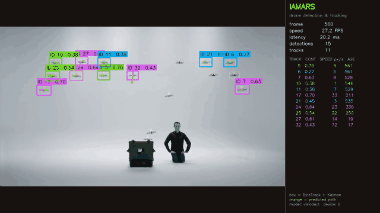
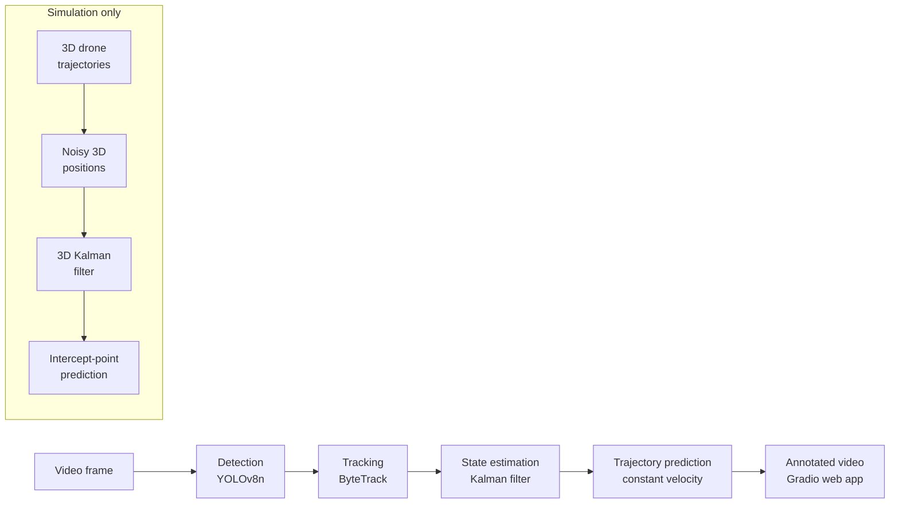

# IAMARS — drone detection, tracking and trajectory prediction

IAMARS (Intelligent Aerial Monitoring & Automated Response System) finds small drones
in video, gives each one a stable ID, estimates its position and velocity with a Kalman
filter, and predicts where it will be next. A separate **simulation** evaluates
intercept-point prediction in 3D.

**Live demo page:** [https://huggingface.co/spaces/AvirajV/iamars-drone-tracking](https://huggingface.co/spaces/AvirajV/iamars-drone-tracking) (annotated output video and measured results)

Every number in this README was produced by a script in [`scripts/`](scripts) and is
stored as JSON in [`results/`](results). Re-running the script reproduces it.



*Demo clip: "MagicLab – 24 Drone Flight" by Marco Tempest,
[CC BY 3.0](https://creativecommons.org/licenses/by/3.0/), via
[Wikimedia Commons](https://commons.wikimedia.org/wiki/File:MagicLab_-_24_Drone_Flight.webm), trimmed and annotated.*

## Why this problem

Small consumer drones are cheap, fly low and look like birds or noise to systems built
for aircraft. Monitoring them near airports, prisons, stadiums or critical sites needs
software that can (1) detect a few-pixel object, (2) keep track of *which* drone is
which across frames, and (3) predict motion from noisy measurements. These are the
perception and prediction building blocks studied in counter-UAS research. IAMARS
implements them end to end on a laptop, measures each one, and states where they fail.
It is a research and learning project, not an operational system.

## How it works



| Stage | What it does | Code |
|---|---|---|
| Detection | YOLOv8n (3.0 M parameters), fine-tuned from COCO weights on the VisioDECT drone dataset, one class `drone` | [`iamars/detector.py`](iamars/detector.py) |
| Tracking | ByteTrack: matches boxes to existing tracks by overlap (IoU) with the Hungarian algorithm, first high-confidence boxes, then low-confidence ones | [`iamars/tracker.py`](iamars/tracker.py) |
| State estimation | Linear Kalman filter per track, state = centre, size, velocity; coasts through missed frames | [`iamars/estimator.py`](iamars/estimator.py) |
| Trajectory prediction | Constant-velocity extrapolation of the Kalman state, 0.5 s ahead | [`iamars/predictor.py`](iamars/predictor.py) |
| Intercept-point prediction (simulation) | Closed-form solution of \|p + v t\| = s t for a constant-speed interceptor, evaluated on simulated 3D flights | [`iamars/intercept.py`](iamars/intercept.py), [`iamars/simulation.py`](iamars/simulation.py) |

A single camera measures directions, not distances, so metric intercept points cannot
be computed from video. That stage is therefore run and evaluated only in simulation.

## Quick start

Python 3.10, CPU is enough (an NVIDIA GPU is optional).

```bash
git clone https://github.com/aviraj1805/intelligent-aerial-monitoring.git && cd intelligent-aerial-monitoring
python -m venv .venv && .venv\Scripts\activate      # macOS/Linux: source .venv/bin/activate
pip install -r requirements.txt                      # NVIDIA GPU: requirements-gpu.txt
python scripts/download_assets.py                    # model weights + 35 s sample video
python scripts/render_demo.py                        # writes outputs/demo_annotated.mp4
```

On Windows, keep the project in a short folder path (for example `C:\projects\`): PyTorch
contains files with very long names and pip fails when the full path exceeds 260 characters
unless [long paths are enabled](https://pip.pypa.io/warnings/enable-long-paths).

Web demo: `python app.py`, then open http://127.0.0.1:7860 (upload a video or use the
example). Tests: `pip install -r requirements-dev.txt && python -m pytest -q`.
Hosting options for the demo (free static showcase page, interactive Space, temporary
public link) are described in [`deploy/huggingface/DEPLOY.md`](deploy/huggingface/DEPLOY.md).

## Results

Hardware for all measurements: laptop with Intel Core i5-13420H, NVIDIA GeForce RTX 2050
(4 GB), 16 GB RAM, Windows 11, on AC power (recorded inside each JSON file).

### Detection

| Test set | Images | mAP@0.5 | mAP@0.5:0.95 | Precision | Recall | Source |
|---|---|---|---|---|---|---|
| VisioDECT held-out test (block split) | 1,800 | 0.965 | 0.596 | 0.960 | 0.957 | [json](results/detection_v2_visiodect_block_test.json) |
| Anti-UAV-RGBT RGB frames, never seen in training | 3,424 | 0.291 | 0.143 | 0.571 | 0.274 | [json](results/detection_v2_antiuav_rgb_test.json) |

Produced by [`scripts/eval_detection.py`](scripts/eval_detection.py). mAP@0.5 counts a
detection as correct when its box overlaps the true box by at least 50 %; mAP@0.5:0.95
averages over stricter overlaps up to 95 %. VisioDECT images are consecutive video
frames, so the split assigns **blocks of 50 consecutive frames** to train/val/test
(14,515 / 4,302 / 1,800 images). A random split would leak near-duplicate frames into
the test set. The second row shows the domain gap on a different dataset and camera.
Details and training setup: [`docs/MODEL_CARD.md`](docs/MODEL_CARD.md).

### Tracking

| Evaluation | Videos | Frames | MOTA | IDF1 | ID switches | Source |
|---|---|---|---|---|---|---|
| Anti-UAV-RGBT test, IAMARS detector + ByteTrack | 91 | 85,374 | 0.067 | 0.178 | 452 | [json](results/tracking_antiuav_test.json) |
| Same videos, teammate YOLOv8m detector (trained on DUT-Anti-UAV) + ByteTrack | 91 | 85,374 | 0.607 | 0.386 | 1,217 | [json](results/tracking_antiuav_test_uav_rgb_yolov8m.json) |
| Same videos, ground-truth boxes as input (tracker upper bound) | 91 | 84,588 | 0.928 | 0.485 | 1,384 | [json](results/tracking_antiuav_test_oracle.json) |
| MultiUAV swarm videos, ground-truth boxes as input | 20 | 14,978 | 0.985 | 0.924 | 297 | [json](results/tracking_multiuav_train_oracle.json) |

Produced by [`scripts/eval_tracking.py`](scripts/eval_tracking.py) with
[py-motmetrics](https://github.com/cheind/py-motmetrics) (match = IoU ≥ 0.5).
MOTA = 1 − (misses + false positives + ID switches) / ground-truth boxes;
IDF1 = how often a drone keeps the *same* ID over the whole video.
ByteTrack settings were tuned on the 67 Anti-UAV **validation** videos
([json](results/tracking_antiuav_val_tune.json)) and then fixed for the test runs.

What the rows show: on Anti-UAV the IAMARS detector finds only 26 % of drones
(recall 0.264), which caps MOTA; with a detector suited to that footage the same tracker
reaches MOTA 0.607. With perfect boxes the tracker still loses identities
(IDF1 0.485) because Anti-UAV is filmed by a pan-tilt camera that re-centres on the
drone, so boxes jump between frames and IoU matching breaks. On the MultiUAV swarm
videos, with perfect boxes, the same tracker keeps 565 drones' identities well
(IDF1 0.924).

### Speed

Full pipeline per frame (detect + track + Kalman + predict), batch size 1, on the
1280 × 720 sample video, 1,044 frames timed after 20 warm-up frames.

| Device | Mean latency | 95th percentile | Pipeline FPS | FPS incl. drawing | Source |
|---|---|---|---|---|---|
| NVIDIA RTX 2050 (GPU) | 11.3 ms | 15.16 ms | 88.5 | 50.2 | [json](results/benchmark_gpu.json) |
| Intel i5-13420H (CPU only) | 49.51 ms | 56.85 ms | 20.2 | 17.3 | [json](results/benchmark_cpu.json) |

Produced by [`scripts/benchmark_speed.py`](scripts/benchmark_speed.py). Video
decoding is excluded; the last column adds drawing the annotated frame.

### Intercept-point prediction (simulation)

**Simulation only: synthetic drone trajectories and synthetic sensor noise.**
1,000 trials per flight pattern. A simulated sensor measures the drone's 3D position at
30 Hz with 1 m noise per axis; after 2 s a 3D Kalman filter's estimate is used to solve
for the point where an 80 m/s interceptor would meet the drone. **Hit** = predicted
point within 1 m of the drone's true position at that moment.

| Flight pattern | Hit rate (≤ 1 m) | Median miss | Hit rate with true state (oracle) |
|---|---|---|---|
| Straight | 28.3 % | 1.36 m | 100 % |
| Turning | 1.4 % | 13.52 m | 8.2 % |
| Jinking (random manoeuvres) | 0.0 % | 16.65 m | 0.3 % |

Straight-flight hit rate against sensor noise: 81.5 % at 0.25 m, 63.8 % at 0.5 m,
28.3 % at 1 m, 4.4 % at 2 m. Produced by
[`scripts/eval_intercept_sim.py`](scripts/eval_intercept_sim.py)
([json](results/intercept_simulation.json)). The oracle column shows that the solver is
exact for straight flight; the misses come from velocity-estimation noise and, for
turning or manoeuvring drones, from the constant-velocity assumption.

## Reproduce the numbers

The datasets are public but not redistributed here; download them from their sources.

```bash
pip install -r requirements-dev.txt
# Detection: VisioDECT (IEEE DataPort) and Anti-UAV-RGBT
python scripts/prepare_visiodect.py --zip <VisioDECT archive>.zip
python scripts/eval_detection.py --data datasets/visiodect.yaml
python scripts/prepare_antiuav.py --zip <Anti-UAV-RGBT>.zip
python scripts/eval_detection.py --data datasets/antiuav_rgb_test.yaml
# Tracking: Anti-UAV-RGBT and MultiUAV (Anti-UAV challenge)
python scripts/eval_tracking.py --dataset antiuav --zip <Anti-UAV-RGBT>.zip --split val --tune
python scripts/eval_tracking.py --dataset antiuav --zip <Anti-UAV-RGBT>.zip --split test [--oracle]
python scripts/eval_tracking.py --dataset multiuav --zip <MultiUAV_Train>.zip --split train --max-videos 20 --oracle
# Speed, simulation, training
python scripts/benchmark_speed.py --device 0        # or --device cpu
python scripts/eval_intercept_sim.py
python scripts/train_detector.py                    # about 4.5 h on an RTX 2050
```

## Limitations and next steps

- **Domain gap.** 0.965 mAP@0.5 on VisioDECT but 0.291 on Anti-UAV footage; the model
  also misses drones filmed close up and can fire on on-screen overlays.
  *Next:* train on several datasets (VisioDECT, DUT-Anti-UAV, Anti-UAV) with hard
  negatives such as birds and camera overlays.
- **Camera motion breaks identity.** IoU-only association fails when the camera pans.
  *Next:* camera-motion compensation (as in BoT-SORT) or appearance features.
- **Tracker tuning.** The best ByteTrack setting lies at the edge of the searched grid;
  a wider search could do better.
- **No range from one camera.** Trajectories are in pixels; intercept-point prediction is
  simulation only and assumes a sensor that measures 3D position.
  *Next:* stereo or radar fusion; a multiple-model filter (IMM) for manoeuvring drones.
- **Single class.** Birds and aircraft were not in training or testing, so the false-alarm
  rate on them is unknown.
- **Speed** was measured on one laptop at batch size 1. The optional three-model fusion
  mode (`--fusion`) has not been evaluated.
- supervision 0.28 marks its ByteTrack implementation as deprecated; versions are pinned.

## Project history

The first detector reported mAP@0.5 0.98 during training, but scored **0.000** when
re-evaluated against the dataset's own boxes. Its training labels had been converted
with each box's corner used as its centre, so every prediction was shifted by half a box
and the training metrics could not show it. The model in this repo was retrained on
correctly converted labels with a leakage-aware split; the analysis and both
measurements are in [`docs/MODEL_CARD.md`](docs/MODEL_CARD.md).

## Repository layout

```
iamars/        library: detector, tracker, estimator, predictor, intercept, simulation, pipeline, visualize
scripts/       command-line tools: data preparation, training, evaluation, benchmark, demo
tests/         pytest suite (runs without model weights or GPU)
results/       measured results (JSON) and training curves
docs/          model card, demo GIF
app.py         Gradio web demo;  deploy/huggingface/ has the Space config
launcher.py    optional PyQt6 desktop launcher
```

**Tech stack:** Python 3.10, PyTorch 2.5.1, Ultralytics YOLOv8 8.4.48, supervision 0.28
(ByteTrack), NumPy (Kalman filter), OpenCV, py-motmetrics, Gradio, pytest.

## Credits and license

Team project led by Aviraj Virape. The optional YOLOv8m RGB and IR detectors used by
`--fusion` were trained by teammate Aditya Akolkar. Datasets: VisioDECT (IEEE DataPort),
Anti-UAV-RGBT and MultiUAV (Anti-UAV challenge); each under its own terms.

No license file has been chosen yet. Ultralytics YOLOv8 is AGPL-3.0, which affects how
this code can be reused.
