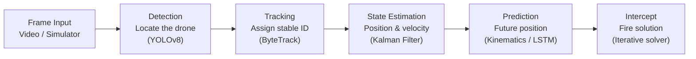

# IAMARS — Intelligent Aerial Monitoring & Automated Response System


**A simulation-first, algorithm-driven pipeline for detecting, tracking, and computing intercept solutions for small, low-altitude aerial drones — closing the 10–50 km affordability gap that today's counter-drone systems don't cover.**

---

## Table of Contents

- [Problem Statement](#problem-statement)
- [Solution Overview](#solution-overview)
- [System Architecture](#system-architecture)
- [Tech Stack](#tech-stack)
- [Repository Structure](#repository-structure)
- [Getting Started](#getting-started)
- [Usage](#usage)
- [Dashboard & Demo](#dashboard--demo)
- [Success Metrics](#success-metrics)
- [Roadmap](#roadmap)
- [Glossary](#glossary)
- [License](#license)

---

## Problem Statement

Small commercial and hobbyist drones are cheap, accessible, and hard to detect with conventional surveillance infrastructure, which is built for larger, higher-altitude aircraft. This leaves a capability gap for **localised (10–50 km) monitoring**:

| Root Cause | Why it matters |
|---|---|
| **Cost barrier** | Military-grade counter-drone systems cost millions and target 100+ km coverage — there's no affordable mid-tier option for localised deployment. |
| **Detection limitation** | Standard radar/camera systems aren't tuned for small, slow, low-altitude objects that blend into background clutter. |
| **Lack of automation** | Existing affordable systems can detect but still need a human in the loop — at drone speeds, manual reaction time isn't fast enough for accurate response. |

IAMARS is the **software intelligence layer** — detection, tracking, prediction, and fire-control math — that a future affordable response system would be built on.

## Solution Overview

Since no physical hardware is available at this stage, IAMARS is built as a **complete software simulation**: a mathematical drone simulator generates realistic (noisy) flight paths, synthetic frames are rendered from that output, and every algorithmic module is validated against known ground truth before any hardware integration is attempted — standard practice for de-risking defence/aerospace software.

| Component | MVP Implementation |
|---|---|
| Camera / sensor | Mathematical drone simulator (Python) |
| Video frames | Synthetic frames rendered from simulator output |
| Drone detection | YOLOv8 fine-tuned on the VisDrone dataset |
| Tracking | ByteTrack |
| State estimation | Kalman Filter (`filterpy`) |
| Trajectory prediction | Kinematics + optional LSTM |
| Fire-control solution | Iterative intercept solver with ballistic correction |
| Visualisation | Real-time 2D/3D dashboard with telemetry overlay |

## System Architecture

Every video frame moves through five sequential modules, completing the full cycle within a single frame interval (~33 ms at 30 FPS):



**Runtime design:** a producer–consumer architecture with a shared frame buffer — the simulator writes frames at 30 FPS, a detection thread runs inference and pushes to a tracking queue, a tracking/estimation thread runs ByteTrack + Kalman Filter, a fire-solution thread computes the intercept, and a display thread renders the dashboard at up to 30 FPS. End-to-end latency (simulator output → fire solution) is measured against a **<100 ms** target.

## Tech Stack

| Layer | Technology | Purpose |
|---|---|---|
| AI & Detection | Python, PyTorch, Ultralytics YOLOv8 | Train/run the drone detection model |
| Tracking | `supervision`, ByteTrack | Stable identities across frames |
| State Estimation | `filterpy` (Kalman Filter) | Smooth noisy position data, estimate velocity |
| Trajectory & Math | NumPy, SciPy | Kinematic prediction, coordinate transforms |
| Simulation | Matplotlib, Pygame | Drone flight simulator & 3D visualisation |
| Data & Labelling | Roboflow, CVAT | Dataset management and annotation |
| Model Export | ONNX, TensorRT | Faster inference (later stage) |
| Version Control | Git, GitHub | Code management & collaboration |

## Repository Structure

```
intelligent-aerial-monitoring/
├── simulator/              # Step 1 — drone flight simulator (kinematics + Gaussian noise, 30Hz)
├── detection/              # Step 2 — YOLOv8 drone detector (VisDrone fine-tune)
├── tracking/                # Step 3 — ByteTrack multi-object tracking
├── estimation/              # Step 4 — Kalman Filter state estimation
├── prediction/              # Step 5 — trajectory / future-position prediction
├── intercept/                # Step 6 — fire-solution (azimuth, elevation, time-of-flight)
├── integration/              # Step 7 — producer-consumer pipeline wiring all modules together
├── visualization/            # Real-time dashboard & telemetry rendering
├── models/                   # Trained weights / exported ONNX models
├── configs/                   # Runtime & module configuration
├── data/                      # Synthetic / training data
├── demo/                       # Demo assets and scripts
├── results/model_reports/       # Evaluation reports (mAP, latency benchmarks)
├── config.py                     # Global configuration entry point
├── launcher.py                    # GUI launcher / pipeline entry point
└── Requirements.txt                # Python dependencies
```

## Getting Started

```bash
git clone https://github.com/aviraj1805/intelligent-aerial-monitoring.git
cd intelligent-aerial-monitoring

python -m venv venv
source venv/bin/activate      # on Windows: venv\Scripts\activate

pip install -r Requirements.txt
```

**Recommended environment** (matches the dev/demo build): CUDA-enabled GPU, PyTorch with CUDA support, OpenCV 4.10+. The pipeline will run on CPU for development, but real-time (~30 FPS) performance assumes a CUDA GPU.

## Usage

Launch the system through the GUI launcher, which handles model loading, system checks, and video queueing:

```bash
python launcher.py
```

From the launcher you can queue one or more video files (or the built-in simulator feed), start the pipeline, and monitor live progress, FPS, and system logs. For the full tactical view — live bounding boxes, tracking IDs, predicted trajectory, and the computed fire solution (azimuth, elevation, time-to-intercept) — open the tactical dashboard view from the same launcher.

## Dashboard & Demo

IAMARS ships with two operator-facing views (mockups included in `demo/`):

- **Launcher** — system status (CUDA/PyTorch/model checks), video queue management, live processing log, and pipeline controls.
- **Tactical Dashboard** — real-time video/telemetry view showing detection boxes, track ID, velocity, Kalman-smoothed trajectory, predicted intercept point, and live fire-solution values (azimuth, elevation, time-of-intercept), alongside a per-stage pipeline status bar (Detect → Fuse → Track → Kalman → Predict → Intercept).

*(Add a screenshot or GIF of each view here once captured from a live run — this is the section reviewers/HOD will look at first.)*

## Success Metrics

| Metric | Target |
|---|---|
| Detection accuracy (mAP@0.5) | ≥ 0.60 |
| End-to-end pipeline latency | < 100 ms |
| Intercept accuracy | % of fire solutions within 1 m of the drone's actual position (primary MVP success measure) |

## Roadmap

- [x] Drone flight simulator with noise and multiple flight patterns
- [x] YOLOv8 detection fine-tuned on VisDrone
- [x] ByteTrack multi-object tracking
- [x] Kalman Filter state estimation
- [x] Kinematic trajectory prediction
- [x] Iterative intercept solver with ballistic correction
- [x] Real-time integration pipeline + visualisation dashboard
- [ ] LSTM-based prediction for complex/evasive manoeuvres
- [ ] ONNX / TensorRT export for optimised inference
- [ ] Hardware-in-the-loop integration (real sensors/cameras)

## Glossary

| Term | Definition |
|---|---|
| **YOLOv8** | Real-time object detection network, fine-tuned here to detect drones. |
| **ByteTrack** | Links detections across frames into continuous, stable-ID tracks. |
| **Kalman Filter** | Combines a motion model with noisy measurements for smooth position/velocity estimates. |
| **mAP@0.5** | Mean Average Precision at 50% overlap — standard detection accuracy metric. |
| **State vector** | Position, velocity, and acceleration describing an object at a moment in time. |
| **Intercept point** | The future 3D location where the projectile and target coincide. |
| **Azimuth / Elevation** | Horizontal / vertical pointing angles of the fire-control solution. |
| **Ballistic correction** | Elevation adjustment compensating for gravity-induced drop over time-of-flight. |

## License

No license file is currently present in this repository. Add a `LICENSE` file (e.g. MIT, Apache-2.0) if you intend for others to reuse this code.

---

*IAMARS v1.0 — MVP planning & architecture, May 2026. Simulation-only; no physical hardware, sensors, or weapons are used or required at this stage.*
